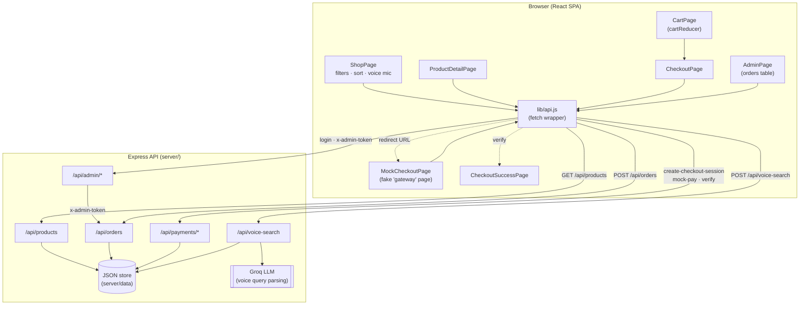

# ecom

A full-stack ecommerce demo built as a React learning project — starting from plain `useState`, working up through `useReducer`, `useContext`, custom hooks, code-splitting, and finally a small Express backend with voice search, a simulated payment gateway, and an admin dashboard.

This started as **frontend-only practice** (see `HOOKS_README.md` for the original hooks-by-hooks build log) and later grew a real backend. The `main` branch here is the backend-connected version; product data, orders, and payments all go through the Express API in `server/` instead of being faked in the browser.

## Features

- **Shop & product browsing** — category filter, sort, search, product detail page with a quantity selector
- **Voice search** — press the mic, say something like *"show me electronics under 50 dollars"*, and an LLM (via Groq) turns that into structured filters (category, price range, sort) applied to the product list
- **Cart** — `useReducer`-driven cart (add / increase / decrease / remove), persisted across the session
- **Wishlist** — separate context from the cart, same general shape
- **Checkout** — a real order is created (`status: "pending"`) before payment even starts, so nothing is lost if the customer abandons the payment page
- **Simulated payment gateway** — Stripe doesn't support account creation in Pakistan, and local gateways need business KYC just for sandbox keys, so `server/src/routes/payments.js` implements a fake gateway with the *same shape* as a real one (create a checkout session → redirect → confirm → verify server-side). Swapping in a real gateway later only touches this one file.
- **Admin dashboard** — single shared password (`ADMIN_PASSWORD`) protects `/admin` and the order-management API; lets you view all orders and update their status (pending → paid → shipped/cancelled)
- **Dark mode** — toggled via `ThemeContext`, cascades through Tailwind's `dark:` variants
- **Error boundary** — one bad component doesn't take down the whole app
- **Code-splitting** — `CheckoutPage` and `AdminPage` are lazy-loaded, so most visitors never download their code at all

## Tech stack

**Frontend:** React 18, React Router, Vite, Tailwind CSS, `lucide-react` icons
**Backend:** Node/Express, a small JSON-file store (`server/src/services/jsonStore.js`) standing in for a database, Groq (LLM) for voice-search parsing

## Project structure

```
ecom/
├── src/                        # Frontend (React + Vite)
│   ├── components/             # Header, ProductCard, CartPanel, Toast, ErrorBoundary...
│   ├── context/                 # CartContext + cartReducer, WishlistContext, ThemeContext
│   ├── hooks/                   # useProducts, useVoiceSearch
│   ├── lib/api.js               # Single fetch wrapper — every API call goes through here
│   └── pages/                   # ShopPage, ProductDetailPage, CartPage, CheckoutPage,
│                                 # MockCheckoutPage, CheckoutSuccessPage, WishlistPage, AdminPage
│
└── server/                     # Backend (Node + Express)
    └── src/
        ├── routes/              # products, orders, payments, voiceSearch, admin
        ├── services/            # jsonStore (data), llmClient (Groq), seed
        └── middleware/          # adminAuth
```

## Getting started

You need two terminals — one for the API, one for the frontend.

**1. Backend**
```bash
cd server
cp .env.example .env   # fill in GROQ_API_KEY and ADMIN_PASSWORD
npm install
npm run dev             # http://localhost:4000
```

**2. Frontend**
```bash
cp .env.example .env    # defaults to http://localhost:4000/api, fine for local dev
npm install
npm run dev              # http://localhost:5173
```

Product data is auto-seeded into a local JSON store the first time the backend starts — no database setup required.

## Architecture



**Flow in words:**
1. `ShopPage` fetches products and categories from the API; the mic button records speech, sends the transcript to `/api/voice-search`, which asks Groq to turn it into `{category, minPrice, maxPrice, sortBy}` and applies that to the existing filter state.
2. Adding to cart dispatches actions to `cartReducer` (all client-side state — no server round trip needed just to hold a cart).
3. Checkout **first** creates a `pending` order via `/api/orders`, **then** asks `/api/payments/create-checkout-session` for a URL — which points at our own `MockCheckoutPage`, standing in for a real hosted payment page.
4. `MockCheckoutPage` calls `/api/payments/mock-pay` to simulate a successful charge; `CheckoutSuccessPage` then calls `/api/payments/verify`, which checks the session server-side (never trusts the redirect alone) and flips the order to `paid`.
5. `/admin` requires a password (`/api/admin/login`), then attaches it as an `x-admin-token` header on every order-management request, letting an admin view and update order status.

## Notes

- This is a learning/portfolio project, not a production store — the "database" is a JSON file, the payment gateway is simulated, and admin auth is a single shared password rather than per-user accounts.
- See `HOOKS_README.md`, `VOICE_SEARCH.md`, `BACKEND_AND_VOICE_CHANGES.md`, and `CHANGELOG.md` for the step-by-step build history.
